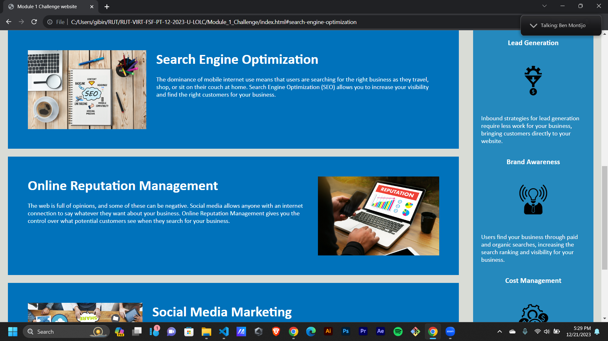
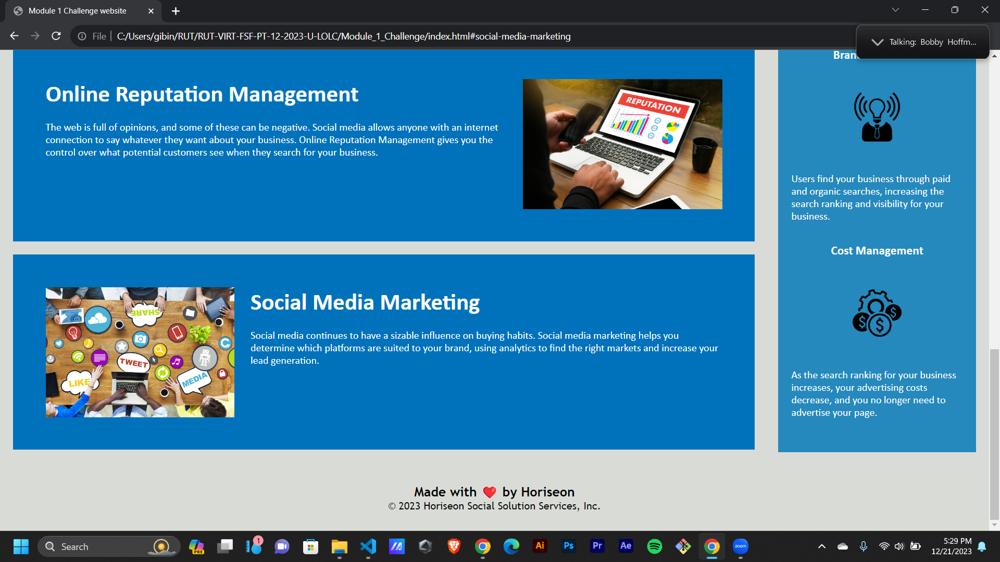

# Module_1_Challenge

The Horiseon webpage includes a navigation bar, a header image, and cards with text and images at the bottom of the page.
This Webpage is created as part of the Module 1 Challenge.

index.html defines the structure of the webpage.

style.css is used to provide various styles to the webpage.

links will function correctly in this webpage.

CSS selectors and properties are consolidated and organized.

CSS file is properly commented.

* The URL of the deployed application - https://gibinmgeorge.github.io/Module_1_Challenge/

* The URL of the GitHub repository - https://github.com/GibinMGeorge/Module_1_Challenge

screenshots - 

